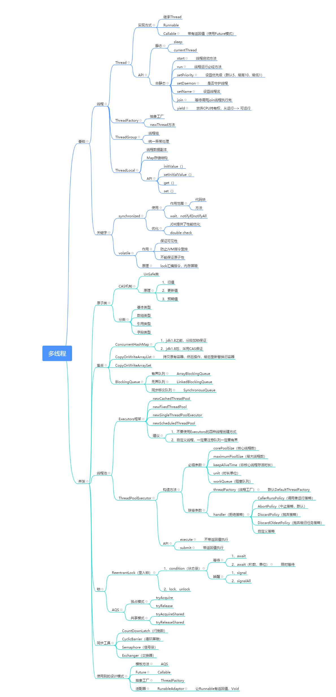

### Java多线程技术

##### 介绍
- 这里列出一些和多线程有关的技术、集合、锁以及相关的设计模式.。

#### 建议
- 该导图可以作为复习以及学习的知识大纲，但是初学者我建议还是好好啃啃JUC包下的类，你会发现很多新大陆的。

- 多线程是一个比较难的技术，还有很多思想和技术没有涉及，所以这里列出一些比较常用的。欢迎大家分享知识和指出我的错误！

#### 最后一句
- 在这里，我也希望阅过我画过导图后也能够一起分享知识，一起进步。

#### 导图拷贝
如果想自己修改，可以点击下面链接进行拷贝
[有道云拷贝](https://note.youdao.com/ynoteshare1/index.html?id=16d04b8f5f0b4381032c0624315b756e&type=note)
