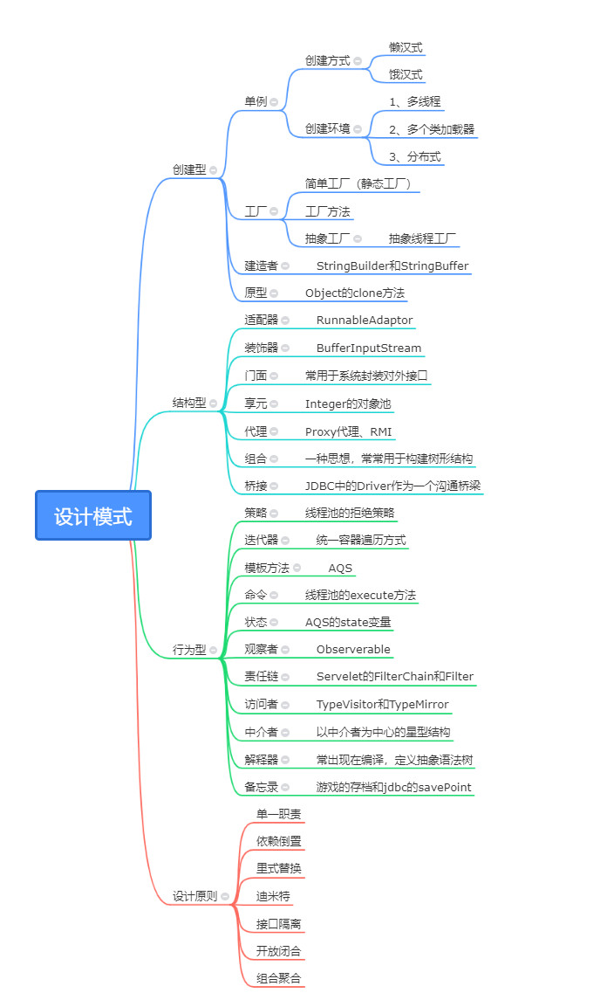

## 设计模式

- 设计模式就是一种设计思想、方案，能够优雅的解决某些场景的问题。不局限语言和编程，也能够融入到生活中。在编程中，设计模式的目的只有一个，就是用简单、便捷、易扩展的方式去满足场景需求。在程序中中没有多余的坏代码，代码复用率高且易于扩展，微调即可满足新的需求。 
- 经典的设计模式一共总结为23中，期间也有很多新的变种设计模式。但是所有的模式，都离不开OO设计的7大原则
- 下面的导图介绍的设计模式，大部分都是来自jdk的

